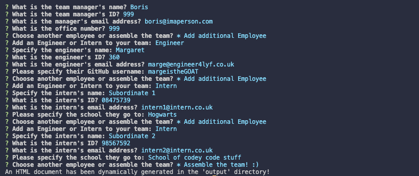
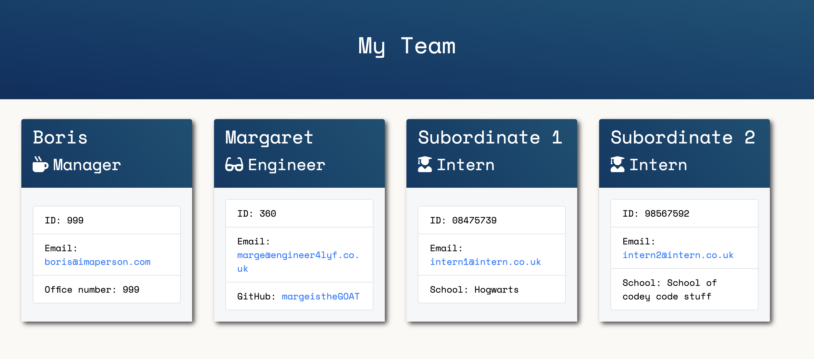

# Team Profile Generator 

[](https://opensource.org/licenses/MIT)

## Description 

### Technologies and Skills Used
- ES6 Javascript 
- Object Orientated Programming / Classes
- Node.js
- Inquirer npm package 
- File system and path node packages
- Jest (Test Driven Development - TDD)

### What I learnt: 

## Installation 

Git clone the repo onto your local machine. To install the necessary dependencies for this programme, please run the following command in the terminal:
```
npm install
```

## Usage

To run this program, write the following command in the terminal: 
```
node index.js
```





## License 

Please refer to the LICENSE in the repo

## Contributing 

If you would like to contribute, you are very welcome to! For this repo, the "fork-and-pull" Git workflow will be used.

Steps:

- Fork the repo on GitHub
- Clone the project to your own machine
- Create a feature branch (git checkout -b BRANCH_NAME) and commit changes to your own branch
- Push your work back up to your fork
- Submit a Pull request so that we can review your changes

Be sure to merge the latest from "upstream" before making a pull request!

## Tests 

To check whether all tests have passed, feel free to run the following command: 

```
npm test
```

---

## Questions

If you have any questions about the repo, open an issue or contact me directly at cameron-edek-poole@gmail.com. 

You can find more of my work by clicking on my GitHub username: [cedekpoole](https://github.com/cedekpoole/).
Feel free to also add me on [LinkedIn](https://www.linkedin.com/in/cam-edek-poole/). :)